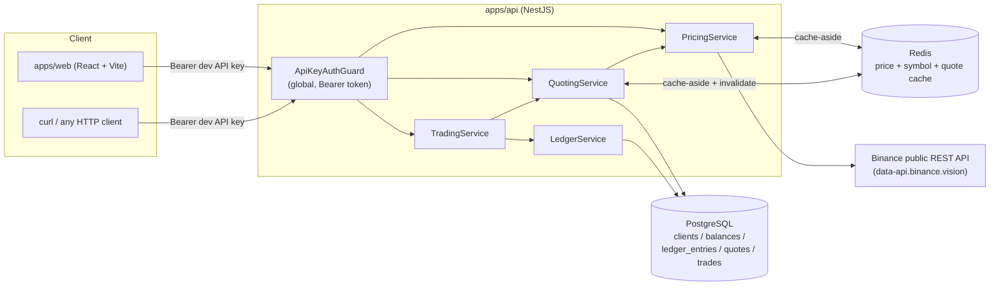

# MiniOpenFX

[](https://github.com/tanmaya-rgb/MiniOpenFX_2/actions/workflows/ci.yml)

MiniOpenFX is an API-first FX quoting and trading service: a client fetches an indicative price,
locks it into a time-boxed quote, executes a trade against that quote, and can view its balances
and trade history — all backed by a real double-entry ledger. It's a take-home assignment, but
it's built the way a small piece of an institutional trading system would be: **trade execution
is transactional and idempotent** (retrying a request never double-executes it), **balances are a
materialized view over an append-only ledger**, not a number that gets mutated directly, **every
DB-level invariant is enforced by real constraints** (unique indexes, Postgres enums), not just
application code, and **indicative pricing is a real cache-aside layer** over a live external
market data feed, with Redis explicitly demoted to "optimization, never source of truth." The
backend is NestJS + PostgreSQL (Drizzle ORM) + Redis, with a small React/Vite frontend
(`apps/web`) for exercising the whole flow in a browser; live prices come from Binance's public
market-data API.

## Architecture



**Pricing** (`apps/api/src/pricing/`) — `PricingService.getPrice()` and `.getSymbolBreakdown()`
front a hand-rolled `BinanceClient` (`binance.client.ts`) with a Redis cache-aside layer
(`RedisService`). Binance is treated as the sole authority on which symbols exist and what their
base/quote assets are — there's deliberately no local allow-list; a malformed symbol is rejected
by a loose format regex (`domain/symbol.ts`) before ever hitting the network, but a well-formed,
non-existent symbol is only ever rejected by Binance's own response.

**Quoting** (`apps/api/src/quoting/`) — `POST /v1/quotes` locks a live price into a time-boxed row
(`quoting.service.ts`, pricing math in `quote-pricing.ts`). A quote's `status` in the database is
only ever `ACTIVE` or `EXECUTED`; `EXPIRED` is a display-only value computed at read time
(`quote.mapper.ts`) by comparing `expiresAt` to `now()` — there is no background expiry sweep.

**Trading & Ledger** (`apps/api/src/trading/`, `apps/api/src/ledger/`) — `POST /v1/trades`
executes a locked quote inside one DB transaction: lock the quote row, validate status/expiry,
lock both balance rows involved in one canonically-ordered statement
(`LedgerService.lockBalanceRows`), debit/credit them, insert the trade, and flip the quote to
`EXECUTED`. Every debit/credit also writes an immutable `ledger_entries` row —
`ledger_entries` is the source of truth for money movement, `balances` is a cache over it, updated
in the same transaction. Idempotency is enforced by a DB unique constraint on
`(client_id, idempotency_key)`, checked both before the transaction (fast path) and via Postgres
error code `23505` after it (race backstop).

**Auth & error handling** (`apps/api/src/common/`) — `ApiKeyAuthGuard` is registered globally via
`APP_GUARD`, so every route requires `Authorization: Bearer <key>` by default; a route opts out
with `@Public()` (only `GET /v1/health` does). Every error response, from a validation failure to
an unhandled exception, is normalized by `AllExceptionsFilter` into `{"error": {"code",
"message"}}`.

## Setup & run

Requires Node.js 20+, Docker, and Docker Compose.

```bash
# 1. Clone and install (npm workspaces — installs both apps/api and apps/web)
git clone https://github.com/tanmaya-rgb/MiniOpenFX_2.git
cd MiniOpenFX_2
npm install

# 2. Start Postgres + Redis
docker compose up -d

# 3. Configure the backend
cp apps/api/.env.example apps/api/.env
# defaults in .env.example work as-is against the docker-compose services

# 4. Migrate + seed (creates one demo client, funded with 10,000 USDT + 1 BTC,
#    and prints the API key that was just seeded — or confirms it already exists)
npm run db:migrate
npm run db:seed

# 5. Run the backend (http://localhost:3000, routes under /v1)
npm run start:dev
```

In a second terminal, to run the frontend:

```bash
# Configure the frontend — VITE_API_KEY must match SEEDED_API_KEY from apps/api/.env
cp apps/web/.env.local.example apps/web/.env.local

npm run dev:web
# → http://localhost:5173
```

Sanity check:

```bash
curl http://localhost:3000/v1/health
# {"status":"ok","postgres":true,"redis":true}
```

## API reference

Every route except `GET /v1/health` requires `Authorization: Bearer <SEEDED_API_KEY>`. All
examples below use the dev default from `apps/api/.env.example`
(`SEEDED_API_KEY=dev-local-api-key`) and were run against a live local instance.

```bash
export API=http://localhost:3000
export KEY=dev-local-api-key
```

**Health** (public)

```bash
curl $API/v1/health
# {"status":"ok","postgres":true,"redis":true}
```

**Indicative price**

```bash
curl -H "Authorization: Bearer $KEY" "$API/v1/prices?symbol=BTCUSDT"
# {"symbol":"BTCUSDT","bid":"75989.11000000","ask":"75989.12000000","timestamp":1789558082836,"source":"binance"}
```

**Create a quote** — `side: BUY` prices at the ask (what you'd pay to acquire `baseCurrency`);
`side: SELL` prices at the bid.

```bash
curl -X POST -H "Authorization: Bearer $KEY" -H "Content-Type: application/json" \
  -d '{"symbol":"BTCUSDT","side":"BUY","baseAmount":"0.001","ttlSeconds":60}' \
  $API/v1/quotes
# {"id":"90b2e4c0-6f24-471f-af8e-bd582c37cd3c","symbol":"BTCUSDT","side":"BUY",
#  "baseCurrency":"BTC","quoteCurrency":"USDT","baseAmount":"0.001",
#  "price":"75989.12000000","quoteAmount":"75.98912","status":"ACTIVE",
#  "expiresAt":"2026-09-16T11:29:08.414Z","createdAt":"2026-09-16T11:28:08.414Z"}
```

**Fetch a quote** — `status` becomes `"EXPIRED"` once `expiresAt` passes, computed at read time
(the underlying DB row never changes to reflect this).

```bash
curl -H "Authorization: Bearer $KEY" $API/v1/quotes/90b2e4c0-6f24-471f-af8e-bd582c37cd3c
# {"id":"90b2e4c0-6f24-471f-af8e-bd582c37cd3c", ... "status":"ACTIVE", ...}
```

**Execute a trade** — requires a client-generated `Idempotency-Key`; replaying the same key
against the same quote returns `200` with the original trade instead of executing again.

```bash
curl -X POST -H "Authorization: Bearer $KEY" -H "Content-Type: application/json" \
  -H "Idempotency-Key: $(uuidgen)" \
  -d '{"quoteId":"90b2e4c0-6f24-471f-af8e-bd582c37cd3c"}' \
  $API/v1/trades
# HTTP 201
# {"id":"4cbedc0a-b59d-4ea5-ac1c-6953bd77739b","quoteId":"90b2e4c0-...",
#  "symbol":"BTCUSDT","side":"BUY","baseCurrency":"BTC","quoteCurrency":"USDT",
#  "baseAmount":"0.001","quoteAmount":"75.98912","price":"75989.12000000",
#  "status":"FILLED","createdAt":"2026-09-16T11:28:14.442Z"}
```

**Balances**

```bash
curl -H "Authorization: Bearer $KEY" $API/v1/balances
# [{"currency":"BTC","available":"1.5848"},{"currency":"ETH","available":"100"},
#  {"currency":"EUR","available":"501.02"},{"currency":"USDT","available":"3803.269528"}]
```

**Trade history** — cursor-paginated (`nextCursor` is opaque; pass it back as `?cursor=`).

```bash
curl -H "Authorization: Bearer $KEY" "$API/v1/trades?limit=2"
# {"trades":[{...},{...}],"nextCursor":"eyJjcmVhdGVkQXQiOi..."}
```

**Deposit** (demo-only funding — see trade-offs below)

```bash
curl -X POST -H "Authorization: Bearer $KEY" -H "Content-Type: application/json" \
  -d '{"currency":"USDT","amount":"100"}' \
  $API/v1/deposits
# [{"currency":"BTC","available":"1.5848"}, ... {"currency":"USDT","available":"3803.269528"}]
```

**Error shape** — every non-2xx response looks like this, regardless of route:

```bash
curl $API/v1/balances
# HTTP 401
# {"error":{"code":"UNAUTHORIZED","message":"Missing or malformed Authorization header"}}
```

| Status | Meaning                                                              |
| ------ | --------------------------------------------------------------------- |
| 400    | invalid input (bad symbol, precision, amount, ttl, malformed cursor) |
| 401    | missing/invalid API key                                              |
| 404    | not found, or belongs to another client (never leaks existence)      |
| 409    | conflict (quote already executed, idempotency key reused on a different quote) |
| 410    | quote has expired                                                    |
| 422    | insufficient balance                                                 |
| 502/504| Binance unavailable / timed out                                      |

## Amount semantics

All amounts are stored as **integer minor units** (`bigint`), fixed at **8 decimal places for
every currency** (`apps/api/src/domain/money.ts`) — a deliberate simplification; a real system
varies decimals per currency (USD = 2, BTC = 8, etc.).

- **`BUY`**: the client pays `quoteCurrency` and receives `baseCurrency`, priced at the **ask**.
- **`SELL`**: the client gives up `baseCurrency` and receives `quoteCurrency`, priced at the
  **bid**.

A quote's `quoteAmount` is computed as `baseAmount × price`, which usually has more precision
than 8 decimal places — rounding is **house-favored**: amounts the client *owes* round **up**,
amounts the client *receives* round **down**, so fractional minor units never leak either way
(`roundToMinorUnits` in `money.ts`).

**Worked example** — BUY 0.00033333 BTC at a live ask of 75989.12:

```
raw = 0.00033333 × 75989.12         = 25.3294533696
BUY  quoteAmount (round UP, 8dp)    = 25.32945337   ← client owes this, rounded in the house's favor
SELL quoteAmount (round DOWN, 8dp)  = 25.32945336   ← client would receive this instead, for a SELL of the same size
```

## Trade-offs (deliberate simplifications)

- **Redis is an optimization layer, never the source of truth.** Every `RedisService` method
  (`getJson`/`setJson`/`del`) fails soft — a cache outage degrades to a cache miss, never breaks
  a request. Every cached value (price, symbol breakdown, quote) is reconstructible from
  Postgres/Binance; nothing is ever written to Redis first.
- **Single seeded client / static Bearer API key**, on both the backend (`db/seed.ts` seeds
  exactly one client) and the frontend (`apps/web/.env.local`'s `VITE_API_KEY` is a static dev
  value, no login flow). A real multi-tenant system needs per-client key issuance/rotation and a
  real session/auth flow; out of scope for this assignment's single-tenant demo.
- **`ApiKeyAuthGuard` scans every client row and runs `bcrypt.compare` per request**
  (`common/guards/api-key-auth.guard.ts`) rather than looking a key up by an indexed hash. With
  exactly one seeded client this is O(1) in practice; it would need to change (e.g. a keyed lookup
  table) before this pattern could support real multi-tenant traffic.
- **No background quote-expiry job.** A quote's DB `status` only ever moves `ACTIVE` →
  `EXECUTED`; `EXPIRED` is computed at read time (`quote.mapper.ts`) and at trade-execution time
  (`trading.service.ts` checks `now() >= expiresAt` inside the transaction). Simpler and
  sufficient for correctness, at the cost of never having a queryable "all expired quotes" view
  without a real sweep.
- **`POST /v1/deposits` is a demo-only funding endpoint**, not a real payment rail — there's no
  bank transfer, card, or on-chain deposit integration in scope. It reuses the same
  `LedgerService.credit` path as the seed script and accepts any syntactically valid currency
  code (2–10 alphanumeric characters) with no real-currency allow-list, since there's no external
  authority to validate a *deposit* currency against the way Binance validates a *trading* symbol.
- **All currencies share one fixed precision (8 decimal places)**, including fiat like EUR/USD
  that would realistically use 2. Simpler ledger math at the cost of not matching real-world
  currency precision conventions.
- **Quote pricing has no spread/fee layered on top of Binance's raw bid/ask** — the "house edge"
  in this system is entirely the bid/ask spread plus favorable rounding, not an explicit fee.

## Testing & CI

```bash
npm run lint          # oxlint, both workspaces
npm run typecheck      # tsc --noEmit, both workspaces
npm test                # unit tests (apps/api, vitest) — 58 tests
npm run test:e2e        # e2e tests (apps/api, vitest + supertest, real Postgres/Redis) — 59 tests
npm run build            # production build, both workspaces
```

E2e tests run against the real local Postgres/Redis containers (no DB mocking) and cover explicit
failure paths, not just the happy path: expired quotes, insufficient balance, duplicate
idempotency keys, mismatched idempotency-key/quote pairs, bad symbols, and missing/invalid auth.

CI (`.github/workflows/ci.yml`) runs the same sequence — lint → typecheck → migrate → seed → unit
tests → e2e tests → build, across both workspaces — against real Postgres 16 and Redis 7 service
containers on every push/PR to `main`. See the badge at the top of this README for current status.

## Deployed URL

**TODO** — not deployed. `apps/api` + Postgres/Redis and `apps/web` currently only run locally via
the setup steps above.
